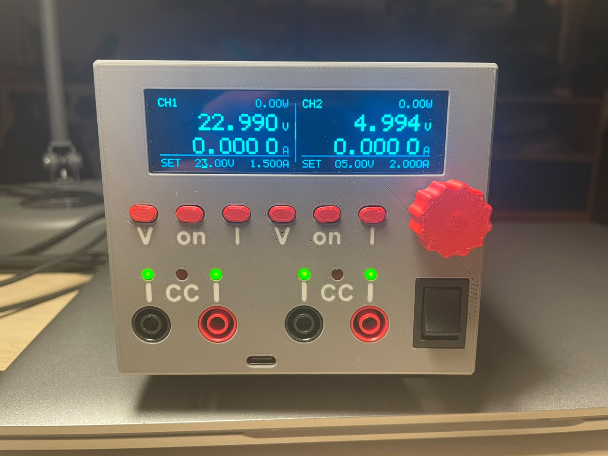

# 2-Channel Pre-Regulated Bench Power Supply

A two-channel laboratory bench power supply, **0–36 V / 0–2 A per channel**, fully
isolated between channels. Each channel pairs a **tracking switch-mode
pre-regulator** with a **linear post-regulator**, so it has the low output noise of
a linear supply without the heat of dropping 36 V across a pass transistor.



Everything here is open: KiCad 10 schematics and layout for both boards, the
firmware for all three microcontrollers, and the design calculations (loop
stability, DC/DC dimensioning, ADC/DAC error budget) that back the component
values.

**Status: built and working.** Both PCBs are assembled and running. One known
footprint error, see [Known issues](#known-issues).

**Schematics in your browser (KiCanvas):**
[Main board](https://kicanvas.org/?repo=https%3A%2F%2Fgithub.com%2Fjanni0609%2F2-Channel-PreReg-Powersupply%2Ftree%2Fmain%2Fhardware_main)
· [Front panel](https://kicanvas.org/?repo=https%3A%2F%2Fgithub.com%2Fjanni0609%2F2-Channel-PreReg-Powersupply%2Ftree%2Fmain%2Fhardware_front)

---

## Specifications

| Parameter | Value |
| --- | --- |
| Channels | 2, independent, galvanically isolated from each other and from the control logic |
| Output voltage | 0 … 36 V per channel |
| Output current | 0 … 2 A per channel (setpoint = current limit, CV/CC) |
| Setpoint resolution | 12-bit DAC ≈ 8.6 mV / 0.49 mA; front panel edits in 10 mV / 1 mA steps |
| Measurement resolution | 16-bit ADC, ~1.9 mV / ~0.1 mA; displayed as 3 decimals (V) and 4 decimals (A) |
| Accuracy | ±3–4 % uncalibrated (DAC band gap dominates); **~±0.05 % V / ±0.1–0.2 % I after 2-point calibration** |
| Protection | Per-channel over-temperature (settable, default 60 °C), system OTP on the heatsink, comms-loss shutdown, input fuses + TVS |
| Regulation | Analog CV and CC loops per channel; MCU sets the references, does not close the loop. CC is indicated by a panel LED driven straight from the loop |
| Display | 256×64 SSD1322 OLED |
| Remote control | SCPI over Ethernet (raw TCP, port 5025) and USB CDC (front-panel USB-C) |
| Cooling | Temperature-controlled 4-wire PWM fan |
| Input | 2 × 40 V DC (channels) + 12 V DC (logic) — see [Power input](#power-input) |

---

## How it works

### Power path (one channel)

```text
40 V in ──▶ LT8612 tracking buck ──▶ Vpre = Vout + 2.2 V ──▶ TIP125 linear pass ──▶ OUT
                    ▲                                              ▲
                    └────────── follows the output ────────────────┘
```

The buck converter does not produce a fixed rail — it **tracks the output**,
holding just 2.2 V of headroom across the linear stage. At full load that is
~200 mV across the 0.1 Ω shunt plus ~2 V across the TIP125 Darlington, i.e. a few
watts of dissipation instead of the ~70 W a plain 40 V linear supply would burn at
0 V out into 2 A.

The linear stage is a classic op-amp regulator built around a **TIP125** PNP
Darlington driven by a **TLV4387** quad op-amp:

- **Voltage loop** — a 4-resistor difference amplifier across OUT+/OUT− scales the
  output by 1/15 (0.06935) and compares it against `Vset` from the DAC.
- **Current loop** — a 0.1 Ω shunt (PCS2512, 1 %, 0.4 W at 2 A) is amplified ×12.25
  and compared against `Iset`. Whichever loop demands less current wins, giving
  automatic CV → CC crossover. The crossover point itself is picked off as a
  `CC/CV` signal that lights the front-panel **CC** lamp directly — no firmware in
  the path, so the indicator is as fast as the loop it reports on.

Both loops are compensated deliberately, not guessed — see
[`Calc/Stability/`](Calc/Stability/) for the plant models, the chosen compensator
values, and the loop-gain / step-response plots.

Per-channel auxiliary rails come off the 40 V input: **LMR51606** buck → 4.5 V,
**AP7384-33Y** → 3.3 V for the MCU and converters, and an **LM2776** charge pump +
**XC6901** negative LDO → −1.2 V so the op-amps can swing cleanly down to 0 V.

### Control architecture

```text
        ┌──────────────── Front panel ────────────────┐
        │  SSD1322 OLED · encoder · 6 buttons · LEDs  │
        └──────────────────────┬──────────────────────┘
                               │ SPI / I²C
                    ┌──────────┴──────────┐        ┌──────────────┐
   Ethernet ────────┤   RP2350 "Brain"    ├────────┤ W5500 · USB  │ SCPI
                    └─────┬─────────┬─────┘        └──────────────┘
                UART0 ◄───┘         └───► UART1     (1 Mbps, ISO6721 isolated)
                  │                         │
        ┌─────────┴────────┐      ┌─────────┴────────┐
        │ ATtiny1614  CH1  │      │ ATtiny1614  CH2  │
        │ ADS1118 · MCP48F │      │ ADS1118 · MCP48F │
        └──────────────────┘      └──────────────────┘
```

Each channel has its own **ATtiny1614** living in that channel's isolated ground
domain. It drives the **MCP48FVB22** dual DAC (the V and I references for the
analog loops), reads the **ADS1118** 16-bit ADC (output voltage and shunt current),
monitors an NTC, sequences the two enable lines, and stores its calibration in
EEPROM. Over-temperature shutdown happens in the channel MCU itself, so a hung
UART link can never leave an output enabled.

The **RP2350** brain owns the user interface and all remote control. It never
touches the analog loops directly; it only sends setpoints and reads telemetry
over the two isolated 1 Mbps UART links.

---

## Boards

### `hardware_main/` — main board (`DualPreRegPowerSupply.kicad_pro`)

Both power channels, both channel MCUs, the brain, and the digital supply on one
PCB. Hierarchical sheets:

| Sheet | Contents |
| --- | --- |
| `Ch1Power` (×2 instances) | One complete channel — the sheet below is instantiated twice |
| ├ `Input` | 40 V input, fuse, TVS, common-mode choke |
| ├ `Power` | Channel aux rails: 4.5 V, 3.3 V, −1.2 V |
| ├ `DCDCTracking` | LT8612 tracking pre-regulator |
| ├ `Linear_PostReg` | TIP125 pass element, V and I loops, shunt, sense amps |
| ├ `DAC_ADC` | MCP48FVB22 DAC, ADS1118 ADC, filtering |
| └ `MCU` | ATtiny1614, NTC, ISO6721 isolated UART, UPDI header |
| `Control` | RP2350-Tiny, W5500 Ethernet, front-panel connectors, fan |
| └ `Digi_Power` | 12 V input → AP63200WU → 3.3 V logic rail |

Fabrication outputs (Gerbers, BOM, CPL) are in
[`hardware_main/production/`](hardware_main/production/); an interactive BOM is at
[`hardware_main/bom/ibom.html`](hardware_main/bom/ibom.html).

### `hardware_front/` — front panel (`Front Panel.kicad_pro`)

The user interface board: SSD1322 OLED header, rotary encoder with push button,
6 push buttons, 6 status LEDs (per channel: two green output-ON indicators, one
over each banana-jack pair, plus the red CC lamp), buzzer, and an **MCP23008** I²C
expander that collects the buttons and drives the buzzer. The green indicators run
off the corresponding channel's isolated 3.3 V rail, so each half of the panel
stays in its own ground domain. Fabrication outputs in
[`hardware_front/production/`](hardware_front/production/).

---

## Firmware

Both projects build with **PlatformIO**.

### `firmware/brain/main/` — RP2350 brain

Waveshare RP2350-Tiny (built against `waveshare_rp2350_zero`). Handles the OLED
UI, encoder and buttons, fan control, the UART links to both channels, and the
SCPI server on Ethernet + USB.

```sh
cd firmware/brain/main
pio run                 # build
pio run -t upload       # flash (UPF2 / USB bootloader)
```

RP2350 pin map (also documented at the top of `platformio.ini`):

| Function | Pins |
| --- | --- |
| OLED SSD1322 (SPI1) | RES 9, SCK 10, MOSI 11, DC 12, CS 13 |
| Rotary encoder (PIO quadrature) | A 14, B 15 |
| W5500 Ethernet (SPI0) | CS 17, SCK 18, MOSI 19, MISO 20, RST 21, INT 22 |
| MCP23008 expander (I²C1) | SDA 6, SCL 7, INT 8 |
| Channel UARTs @ 1 Mbps | CH1: TX 0 / RX 1 · CH2: TX 4 / RX 5 |
| Heatsink NTC / fan PWM | ADC3 (GPIO29) / GPIO26 (25 kHz) |

[`firmware/brain/UI-test/`](firmware/brain/UI-test/) is the earlier UI-only
prototype the production firmware grew out of; it is kept for display work without
the power hardware attached.

### `firmware/channel/` — ATtiny1614 channel

megaTinyCore, 16 MHz internal oscillator, flashed over UPDI. Layered cooperative
super-loop with an explicit state machine
(`INIT → SELFTEST → IDLE ↔ RUN → FAULT`). See
[`firmware/channel/README.md`](firmware/channel/README.md) for the module tree,
the state machine, and the calibration procedure.

```sh
cd firmware/channel
pio run -t fuses        # once: set OSCCFG to 16 MHz (required!)
pio run -t upload       # flash over UPDI
```

> The `-t fuses` step is not optional on a fresh part. The default fuse selects the
> 20 MHz oscillator base; with a 16 MHz build every timing (UART baud, delays,
> telemetry period) comes out 25 % off.

### Brain ↔ channel protocol

A small binary framing: `[SOF 0xA5][LEN][CMD][payload][CRC8]`, defined in
`firmware/channel/include/protocol.h` (mirrored into the brain project). The
channel pushes a telemetry frame every 100 ms (V, I, P, temperature, state,
flags) and ACK/NACKs every command. If the brain goes quiet for 1 s while an
output is on, the channel turns that output off by itself.

---

## Remote control (SCPI)

The instrument speaks an **SCPI-1999 / IEEE-488.2 subset** on two transports at
once — raw TCP port 5025 over Ethernet, and USB CDC — so it works with PyVISA,
NI-MAX, `lxi`, or a plain terminal.

```text
*IDN?                 → PreReg,PSU-2CH-36V2A,SN00001,0.2.0
APPL CH1,12.0,1.0
OUTP ON,(@1)
MEAS:VOLT? (@1)       → 12.001
MEAS:CURR? (@1)       → 0.2531
```

Channel lists (`(@1)`, `(@1,2)`) and stateful `INST:NSEL` selection are both
supported, along with the STATus register model, an error queue, and the
CALibration subsystem. The full command reference — including UART mappings and
known deviations — is in [`firmware/SCPI/commands.md`](firmware/SCPI/commands.md).

Network settings (DHCP or static IP, netmask, gateway, hostname) are configured
from the front panel under *Settings → Network*, and only take effect on **Apply**,
so a half-typed IP never goes live.

---

## Front panel

The main screen shows both channels side by side: measured voltage and current in
large digits, output power in the corner, and the active setpoints on the bottom
row. Six buttons (`V · on · I` per channel) select what the encoder edits and
toggle each output; the encoder push button moves the digit cursor — underlined on
screen — so any digit can be dialled directly instead of scrolling through the
whole range.

Below the buttons, each channel has two green output-ON LEDs flanking a red **CC**
lamp that lights whenever that channel leaves constant-voltage regulation, then the
output banana jacks. The USB-C port for SCPI-over-USB and firmware updates sits in
the middle of the panel; the mains switch is on the right. The enclosure is 3D
printed.

The Settings menu (encoder-driven, see
[`firmware/brain/UI-test/Settings.md`](firmware/brain/UI-test/Settings.md))
covers per-channel diagnostics (temperature, DAC/ADC/comms health, operating
hours, stored calibration values, the manual 2-point calibration wizard), the
temperature and fan curve (start temp, max temp, minimum speed, system OTP),
the network configuration, and system items (firmware version, beeper, brain
runtime, remember-setpoints-on-restart).

---

## Calibration

Every signal path — `VSET`, `ISET`, `VMEAS`, `IMEAS`, per channel — is a straight
line `y = gain·x + offset` fitted from two points and stored in the channel's
EEPROM. This is **required**, not optional: the MCP48FVB22 uses its internal
1.22 V band gap (Vref is not routed on the PCB), and that band gap is specified to
±3.3 %. Calibration removes it, along with the 1 % resistor and shunt tolerances,
leaving roughly ±0.05 % on voltage and ±0.1–0.2 % on current. Until a channel has
been calibrated it reports `FLAG_CAL_INVALID`.

Run it from the front panel (*Settings → Channel n → Manual Cal V/I*, with a
DMM on the output) or remotely via `CAL:POIN` / `CAL:COMM`. Full error budget and
where each term comes from:
[`Calc/DAC_ADC/DAC_ADC_Accuracy_Analysis.md`](Calc/DAC_ADC/DAC_ADC_Accuracy_Analysis.md).

---

## Power input

The supply is fed from three off-the-shelf Mean Well modules:

| Input | Supply | Feeds |
| --- | --- | --- |
| J101 | Mean Well **LRS-75-36**, trimmed to **40 V** | Channel 1 |
| J601 | Mean Well **LRS-75-36**, trimmed to **40 V** | Channel 2 |
| J901 | Mean Well **RS-15-12** (12 V) | Brain, OLED, Ethernet, fan |

Each channel input has its own 3.5 A fuse, TVS clamp, and common-mode choke.
Because the two channel supplies are separate isolated modules and the UART links
are isolated with ISO6721 digital isolators, the two outputs are genuinely
floating and independent — they can be wired in series or referenced separately.

Outputs terminate in front-panel banana jacks (J201/J202 and J402/J403).

---

## Repository layout

```text
hardware_main/     KiCad 10 project — main board (power, MCUs, brain)
hardware_front/    KiCad 10 project — front panel (OLED, encoder, buttons)
firmware/
  brain/main/      RP2350 production firmware (UI + comms + SCPI)
  brain/UI-test/   Earlier UI-only prototype
  channel/         ATtiny1614 channel firmware
  SCPI/            SCPI command reference
  requirements/    Original firmware requirements notes
  Datasheets/      Datasheets for the main ICs
Calc/
  Stability/       V and I loop compensation — notebooks + typeset report
  DCDC Calc/       LMR51606 40 V → 4.5 V aux buck design
  DAC_ADC/         Setpoint/measurement error budget
```

---

## Design notes and calculations

- [`Calc/Stability/stepbystep/`](Calc/Stability/stepbystep/) — Jupyter notebooks
  deriving the voltage and current loop transfer functions (including the TIP125's
  β(s) roll-off and the op-amp GBW corner), the chosen compensator values, load
  sweeps, and step responses. The typeset summary is
  `Calc/Stability/stepbystep/report/loop_analysis.pdf`.
- [`Calc/DCDC Calc/LMR51606X_40V_4V5_200mA_design.md`](Calc/DCDC%20Calc/LMR51606X_40V_4V5_200mA_design.md)
  — full worked design of the 40 V → 4.5 V auxiliary buck.
- [`Calc/DAC_ADC/DAC_ADC_Accuracy_Analysis.md`](Calc/DAC_ADC/DAC_ADC_Accuracy_Analysis.md)
  — where every microvolt of error comes from, and what calibration does and does
  not fix.

---

## Known issues

- **AP7384-33Y footprint (channel 3.3 V LDO)** — the footprint on the main board is
  wrong; the part needs rework/adaptation to fit. Fix before ordering new boards.
- The ADS1118 PGA is **pinned to ±4.096 V** rather than autoscaling. Each PGA range
  has its own gain/offset error and input impedance, so a single 2-point cal line
  cannot describe all of them — autoscaling made readings drift away from the
  calibration points. Re-enabling it requires per-range calibration
  (`ADC_PGA_*_INDEX` in `firmware/channel/include/config.h`).
- `CALibration:DATA?` returns NaN over SCPI: gain/offset cannot currently be read
  back across the channel link.
- The hostname set in *Settings → Network* is stored and displayed, but the stock
  Ethernet DHCP client does not advertise it to the DHCP server.
- The CV/CC mode is shown on the panel by a hardware-driven LED, but the `CC/CV`
  signal is not routed to a channel MCU pin, so the regulation mode cannot be
  queried over SCPI (`STAT:OPER` has no constant-current bit).

---

## Tools

KiCad 10 · PlatformIO (`raspberrypi` + `atmelmegaavr` platforms) · megaTinyCore ·
Arduino-Pico core · Python/Jupyter for the analysis notebooks.
